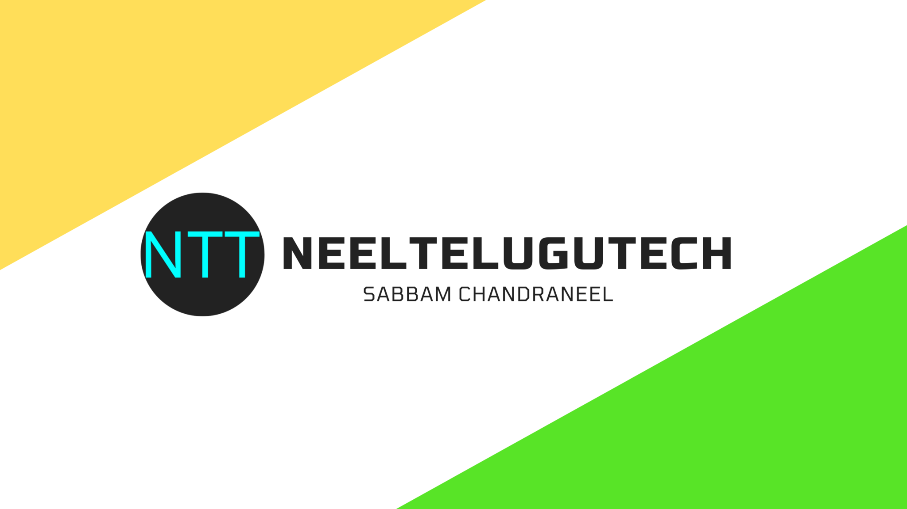

<html>
<head>
 <meta charset="UTF-8">
    <meta http-equiv="X-UA-Compatible" content="IE=edge">
<link rel="stylesheet" href="same.css">
    <meta name="viewport" content="width=device-width, initial-scale=1.0">
<title>Sabbam Hosting</title>
    <nav>
            <ul>
                <li>HOME</li>
                <li>ABOUT</li>
                <li>HOSTING</li>
                <li>PRICING</li>
                <li>BLOG DETAILS</li>
                <li>NEWS</li>
                <li>CONTACT</li>
            </ul>
        </nav>
    <link rel="stylesheet" href="https://cdnjs.cloudflare.com/ajax/libs/font-awesome/4.7.0/css/font-awesome.min.css">
</head>
<header>
<logo>Sabbam Hosting</logo>
</header>  
<body>
<h1>Welcome To Sabbam Hosting</h1>
<h2>Sabbam Hosting Powered  By MannaYuvatha</h2> 

Grab your genuine hosting from us and start your bussiness  from today  Hosting plan starting from <b>99/month</b>

<button><a href="plans.html">View Plans Here</a></button>   
<section>
<h4>Our Partners</h4>  

   

 <h1></h1>

 <h5>Manna Yuvatha</h5>
<button>Subscribe Here</button>

   

 <h1></h1>

 <h5>Hosting Admin</h5>
<button>View Plans Here</button>

   

 <h1></h1>

 <h5>Education</h5>
<button>Subscribe Here</button>

   

 <h1></h1>

 <h5>Web Designer</h5>
<button>View Blogs From Here</button>

</section>
<footer>
Copyright©2021SabbamHosting.Powered By MannaYuvatha.
</body>
</html>